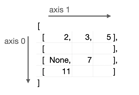

---
jupytext:
  text_representation:
    extension: .md
    format_name: myst
    format_version: 0.13
    jupytext_version: 1.10.3
kernelspec:
  display_name: Python 3
  language: python
  name: python3
---

How to sort arrays and inner arrays
===================================

```{code-cell} ipython3
import awkward as ak
```

Sorting puts the [ak.Array](https://awkward-array.readthedocs.io/en/latest/_auto/ak.Array.html) elements in an ordered sequence: numeric or lexicographical, ascending or descending.

By default, [ak.sort](https://awkward-array.readthedocs.io/en/latest/_auto/ak.sort.html) sorts the elements in non-descending order. The order of equivalent elements is guaranteed to be preserved.

The back-end is an `std::stable_sort` with complexity `O(N·log(N)2)`, where `N = std::distance(first, last)` applications of a comparator. If an additional memory is available, then the complexity is `O(N·log(N))`.

```{code-cell} ipython3
ak.sort(array = ak.Array([[2, 5, 3], [], [None, 0], [1]]))
```

Sorting in axis
---------------

An optional `axis` parameter defines an axis along which to sort. The default is `axis=-1`, which is the last axis.

The [ak.Array](https://awkward-array.readthedocs.io/en/latest/_auto/ak.Array.html) axes are defined similar to Numpy axes. Unlike other operations, sorting does not support `axis=None`.

[](img/sorting-axis.svg)

In [ak.Array](https://awkward-array.readthedocs.io/en/latest/_auto/ak.Array.html), `axis=0` is the "first" axis and `axis=-1` is the last axis.

```{code-cell} ipython3
ak.sort(array = ak.Array([[2, 5, 3], [], [None, 0], [1]]), axis=0)
```

and

```{code-cell} ipython3
ak.sort(array = ak.Array([[2, 5, 3], [], [None, 0], [1]]), axis=1)
```
An empty range is not sorted.

The results make a lot of sense when you understand how the [ak.Array](https://awkward-array.readthedocs.io/en/latest/_auto/ak.Array.html) axis work.

Sorting `None` values
---------------------

Sorting places `None` values at the end of an ordered sequence.

```{code-cell} ipython3
array = ak.Array([[None, None, 3, 2], [1]])
ak.sort(array)
```
similarly, for a one dimentional array:

```{code-cell} ipython3
array = ak.Array([None, None, 3, 2, 1])
ak.sort(array)
```

Sorting order
-------------

The default sorting order is ascending. To switch to a descending order, change the paramerer to `ascending=False`:

```{code-cell} ipython3
ak.sort(array = ak.Array([[2, 5, 3], [], [None, 0], [1]]), ascending=False)
```

Stable sort
-----------

By default, the order of equivalent elements is guaranteed to be preserved. To switch to a quick sort, set a parameter `stable=False`.

Sorting records
---------------

When sorting records, sorting applies to numbers, the records themselves are not sorted.

```{code-cell} ipython3
array = ak.Array(
      [
          {"x": 0.0, "y": []},
          {"x": 11.11, "y": [1]},
          {"x": 2.2, "y": [0, 2]},
          {"x": 33.33, "y": [3, -1, 10]},
          {"x": 4.4, "y": [-2, 0, 4, 14]},
          {"x": 5.5, "y": [25, 15, 5]},
          {"x": 6.6, "y": [26, 6]},
          {"x": 77.77, "y": [77]},
          {"x": 8.8, "y": []},
      ]
  )
sorted_record = ak.sort(array)
sorted_record
```

This is the only case where `ak.sort` returns a record type instead of an [ak.Array](https://awkward-array.readthedocs.io/en/latest/_auto/ak.Array.html):

```{code-cell} ipython3
ak.to_list(sorted_record)
```
